# Campus Compass 完整工作流文档

> 更新日期：2026-06-07 | 基于项目当前代码的完整分析

---

## 一、项目总览

Campus Compass 是一个 **LLM 驱动的校园活动策划 Agent**，采用 **Agent / Skill / Harness 三层架构**，核心特性是 **"Plan-Aware 关键词锚定 + 通用修改意图检测 + 流式方案生成"**。系统支持两种运行模式：

- **Agent 自主决策模式**（有 LLM API Key）：LLM 通过 Function Calling 自主选择工具调用顺序，实现 Thought → Action → Observation 闭环
- **确定性流水线模式**（无 LLM API Key 或降级）：按固定 7 步顺序执行，不依赖 LLM

### 1.1 技术栈

| 层级 | 技术 |
|------|------|
| 后端 | Python 3.12 + Flask |
| 前端 | HTML/CSS/JS + TailwindCSS CDN + Font Awesome 4 |
| 数据库 | SQLite（教室数据 rooms.db + 历史记录 history.db） |
| AI | DeepSeek API (deepseek-chat)，兼容 OpenAI 格式 |
| 记忆系统 | L1（内存 dict）+ L2（SQLite）+ L3（JSON 文件持久化） |
| 搜索 | LLM 驱动的语义搜索（替代 Tavily API） |
| 文档导出 | python-docx（Word 文档生成） |
| 代理支持 | HTTP/HTTPS 代理配置（默认关闭） |

### 1.2 项目文件结构

```
campus-compass/
├── config.py                    # 全局配置（API Key、路径）
├── main.py                      # 命令行入口
├── requirements.txt             # Python 依赖
├── .env.example                 # 环境变量模板
├── agent/                       # Agent 核心层（Harness）
│   ├── agent_loop.py            # Agent 主循环 + Circuit Breaker + Scratch 缓存
│   ├── state.py                 # AgentState 状态管理
│   ├── llm.py                   # LLM 流式/非流式调用
│   ├── llm_client.py            # LLM 创意生成（旧版兼容）
│   ├── workflow.py              # 旧版工作流（已弃用）
│   ├── formatter.py             # HTML 策划书格式化输出
│   ├── proxy.py                 # HTTP 代理管理（默认关闭）
│   ├── skill_loader.py          # 技能匹配（88+关键词 + LLM兜底）
│   ├── word_export.py           # Word 文档导出（python-docx）★NEW
│   ├── harness/                 # 安全控制与可观测性
│   │   └── observ.py            # Trace 结构化追踪
│   ├── memory/                  # 记忆系统
│   │   ├── session.py           # L1+L2 记忆
│   │   ├── persistence.py       # L3 长期记忆（.memory/ JSON）
│   │   └── trim.py              # Token 预算管理（缓存优先）
│   ├── tools/                   # Agent 工具系统
│   │   ├── registry.py          # 工具白名单 + 调度 + 截断 + Circuit Breaker
│   │   └── subagent.py          # LLM 驱动子代理（上下文隔离）
│   └── mcp/                     # MCP 工具
│       └── tavily_search.py     # LLM 语义搜索（替代 Tavily API）
├── engine/                      # 引擎层
│   ├── plan_generator.py        # 方案生成 + JSON 解析（3层兜底）
│   ├── plan_anchor.py           # Plan-Aware 关键词锚定 ★NEW
│   ├── intent_detector.py       # 通用修改意图检测（5类型×3层漏斗）★NEW
│   ├── time_intent.py           # 时间变更检测（15关键词+9正则+学习）★NEW
│   ├── intent_parser.py         # 意图解析（关键词+正则）
│   ├── topic_analyzer.py        # 主题复杂度分析+扩展
│   ├── completeness_checker.py  # 信息补全追问（最多3次）
│   ├── room_scorer.py           # 教室多维度评分
│   ├── room_selector.py         # 双维度教室选择（填充率+拓扑距离）
│   └── template_matcher.py      # 活动模板匹配
├── tools/                       # 工具层
│   ├── db_service.py            # 教室数据库查询（支持多建筑）
│   ├── budget_calc.py           # 预算计算
│   └── topo_loader.py           # 拓扑距离加载器（Dijkstra BFS）
├── data/                        # 数据层
│   ├── init_db.py               # 数据库初始化（E座21教室 + 体育区2 + 机房区2）
│   ├── map.json                 # 校园拓扑地图
│   └── templates.json           # 活动模板
├── web/                         # Web 层
│   ├── app.py                   # Flask 应用（5步交互 + SSE + Word导出）
│   └── templates/index.html     # 前端 UI（玻璃拟态 + 深空主题）
├── skills/                      # 技能库（6种活动类型）
│   ├── lecture_planning/SKILL.md
│   ├── competition_planning/SKILL.md
│   ├── sports_planning/SKILL.md
│   ├── exhibition_planning/SKILL.md
│   ├── performance_planning/SKILL.md
│   └── practice_planning/SKILL.md
├── run.py                       # 一键启动脚本 ★NEW
├── docs/                        # 设计文档
│   ├── 开发日志.md               #   完整开发记录
│   ├── 设计原理.md               #   架构设计
│   ├── 改进方向.md               #   未来改进清单
│   └── 教室评分算法分析.md        #   评分算法详解
├── Learning/                    # Agent 教学材料
├── tests/                       # 测试脚本
└── test_deepseek.py             # DeepSeek 连通性测试
    test_mcp.py                  # MCP 搜索测试
    test_qwen.py                 # 千问连通性测试
```

---

## 二、完整工作流（Agent 模式）

### 2.1 总体流程概览

```
                        ┌─────────────────────────────────────┐
                        │         用户输入活动主题              │
                        │    "我想办一个50人的技术讲座"          │
                        └──────────────┬──────────────────────┘
                                       │
                        ┌──────────────▼──────────────────────┐
                        │     agent_loop.run_agent()           │
                        │     初始化 AgentState + Trace        │
                        │     加载 System Prompt + 长期记忆     │
                        │     messages = [system, user]       │
                        └──────────────┬──────────────────────┘
                                       │
                             ┌─────────▼──────────┐
                             │   有 LLM API Key?   │
                             └──┬───────────────┬─┘
                                │ YES           │ NO
                                ▼               ▼
                    ┌───────────────┐   ┌──────────────────┐
                    │  Agent 循环    │   │  降级流水线模式    │
                    │  (最大15轮)    │   │  (_run_fallback)  │
                    └───────┬───────┘   └────────┬─────────┘
                            │                    │
                            ▼                    ▼
                    ┌───────────────┐   ┌──────────────────┐
                    │ 每一轮:        │   │  8步顺序执行:      │
                    │ 1. Nag检查     │   │  意图→主题→方案    │
                    │ 2. Token裁剪   │   │  →教室→评分         │
                    │ 3. 调用LLM     │   │  →预算→HTML→记忆   │
                    │ 4. 工具分发    │   └────────┬─────────┘
                    │ 5. 结果反馈    │            │
                    │ 6. 循环继续    │            │
                    └───────┬───────┘            │
                            │                    │
                            ▼                    ▼
                    ┌──────────────────────────────────────┐
                    │          返回 HTML 策划书              │
                    │  (formatter.build_html 生成)          │
                    └──────────────────────────────────────┘
```

### 2.2 详细执行步骤

#### 阶段 0：系统初始化

**文件**: `main.py` → `agent_loop.run_agent()` / `web/app.py:chat()`

1. `config.py` 通过 `python-dotenv` 加载 `.env` 环境变量，读取：
   - `LLM_API_KEY` / `LLM_API_URL` / `LLM_MODEL` — LLM 配置
   - `DB_PATH` / `TEMPLATE_PATH` — 数据文件路径

2. `data/init_db.py:init_database()` 初始化 SQLite 数据库：
   - 创建 `rooms` 表（room_id / building / floor / capacity / area / equipment / entrance_note / nav_landmarks / coordinate_x / coordinate_y）
   - 插入 25 个场地：
     - E教学楼 1F：21 间教室（E101~E132，容量 42~314 人，含阶梯教室/普通教室/模拟法庭/录播教室）
     - 体育区：体育馆（300人）、田径场（500人）
     - 机房区：E506（100机位）、E507（100机位）

3. 构建 System Prompt：
   - 基础系统提示词（任务规划规则 + 8 步工具流程 + 行为规则）
   - 注入长期记忆块（`memory/persistence.py:load_memory_block()`）

4. 创建 `AgentState` 实例（dataclass），初始化所有字段为空：
   ```python
   raw_input, intent, expanded_topic, plan, rooms, sorted_rooms,
   budget, participants=50, html_output,
   todos, rounds_since_todo=0, total_tokens_in/out=0, round_count=0,
   tool_call_history, breaker_triggered, matched_skill_name
   ```

5. 创建 `Trace` 实例，开始结构化追踪

---

#### 阶段 1：Agent 主循环（有 LLM API Key 时）

**文件**: `agent/agent_loop.py:run_agent()` (第 87-191 行)

每轮循环 (最多 15 轮)：

**Step 1.1 — Nag 提醒检查**
- 条件：`rounds_since_todo >= 3` 且有未完成的待办项
- 行为：自动向 messages 注入提醒消息，包含当前 TodoWrite 状态渲染
- 目的：防止 LLM "说而不做"（描述要调用工具但并不实际调用）

**Step 1.2 — Token 预算裁剪**
- 调用 `memory/trim.py:trim_to_budget(messages, budget=8000)`
- 算法：保留 system 消息，从头部开始丢弃旧的非 system 消息
- 丢弃 tool 消息时同时丢弃其配对的 assistant 消息

**Step 1.3 — 调用 LLM**
- 通过 `agent/llm.py:chat(messages, tools=TOOL_DEFINITIONS)` 发送请求
- 参数：`temperature=0.7`, `max_tokens=1024`, `timeout=45s`
- 代理支持：通过 `agent/proxy.py:get_proxy()` 获取用户配置的代理
- 返回 OpenAI 格式的响应（含 tool_calls）

**Step 1.4 — 无工具调用处理**
- 若 LLM 返回文本但无 tool_calls：
  - 检查是否有未完成待办 → 注入 nag 消息要求 LLM 调用工具
  - 若无待办 → 认为任务完成，跳出循环

**Step 1.5 — 工具分发**
- 遍历 `tool_calls`，逐个调用 `agent/tools/registry.py:dispatch_tool()`
- 每个工具返回 JSON 字符串结果
- 将结果包装为 `{"role": "tool", "tool_call_id": tc["id"], "content": result}` 追加到 messages
- Trace 记录每次工具执行（名称/成功/耗时）

**Step 1.6 — finalize 检测**
- 若调用了 `finalize` 工具 → 任务完成，返回 `state.html_output`

**Step 1.7 — 循环回退**
- 若循环结束但未调 finalize → 用已有数据自动生成 HTML（`formatter.build_html`）

---

#### 阶段 2：降级确定性流水线（无 LLM API Key 时）

**文件**: `agent/agent_loop.py:_run_fallback_pipeline()` (第 193-251 行)

按固定顺序执行以下 8 步：

| 步骤 | 函数调用 | 文件来源 | 功能 |
|:---:|---------|---------|------|
| 1 | `parse_intent(user_input)` | `engine/intent_parser.py` | 意图解析 |
| 2 | `analyze_topic(user_input)` | `engine/topic_analyzer.py` | 主题分析 |
| 3 | `generate_plan(topic, participants, [])` | `engine/plan_generator.py` | 方案生成 |
| 4 | `query_rooms(capacity_min, building)` | `tools/db_service.py` | 教室查询 |
| 5 | `rank_rooms(rooms, intent)` | `engine/room_scorer.py` | 教室排序 |
| 6 | `estimate_budget(template, participants, type)` | `tools/budget_calc.py` | 预算计算 |
| 7 | `build_html(plan, rooms, budget)` | `agent/formatter.py` | HTML 输出 |

---

#### 阶段 3：Web 交互流程（web/app.py）

**文件**: `web/app.py` — 3 步渐进式交互

**Step W1: 询问活动主题** (step = "ask_topic")

```
用户输入: "科技创新活动"
     │
     ▼
┌──────────────────────────────────────────────┐
│  topic_analyzer.analyze_topic(user_input)     │
│  ├─ 计算复杂度评分 (关键词匹配 + 长度 + 动作词) │
│  ├─ score >= 0.6 → 直接采用 (is_simple=False)  │
│  └─ score < 0.6  → 尝试 LLM 扩展               │
│      ├─ LLM 可用 → expand_topic_via_llm()      │
│      └─ LLM 不可用 → _rule_expand() 规则扩展    │
│                                                  │
│  返回：主题扩展结果                              │
│  状态变更：step → "ask_participants"             │
└──────────────────────────────────────────────┘
```

**Step W2: 询问参与人数** (step = "ask_participants")

```
用户输入: "80人" 或 "80"
     │
     ▼
┌──────────────────────────────────────────────┐
│  _extract_participants(user_msg)              │
│  正则: (\d+)\s*(人|位|名)?                    │
│  提取到 80 → state.participants = 80           │
│  状态变更：step → "ask_details"               │
│                                                  │
│  返回：确认信息卡片（主题 + 人数）               │
│  + "生成完整方案" 按钮                          │
└──────────────────────────────────────────────┘
```

**Step W3: 生成方案** (step = "streaming")

触发方式：
- 用户点击"生成完整方案"按钮
- 用户输入"生成"/"好了"/"OK"/"下一步"/"跳过"
- 信息完整性评估通过（`completeness_checker`，最多追问 3 次）

执行：
- 状态变更为 "streaming"
- 前端通过 SSE（Server-Sent Events）连接 `/chat/stream?session_id=xxx`
- 后端调用 `agent/llm.py:stream_generate_plan(topic, participants)` 流式生成
- 每收到一个 LLM chunk → 实时推送到前端显示
- 生成完成后：
  1. 解析 LLM 返回的 JSON（`parse_plan_response`，3 层兜底解析）
  2. 场地智能路由（电竞→机房区、体育→体育区、其他→E教学楼）
  3. 查询教室 → 双维度评分（填充率 50% + 拓扑距离 50%）
  4. 调用 `formatter.build_html()` 生成 HTML
  5. 存储 `state["last_plan"] = plan`（供后续关键词锚定）
  6. 保存到记忆系统（L1+L2+L3）
  7. 状态变更：step → "review"
  8. 前端将流式文本替换为格式化 HTML 卡片（含"一键导出 Word"按钮）

**Step W4: 迭代改进** (step = "review") ★核心新增

用户输入改进需求（如"把主办单位改成电竞社"、"开幕致辞改短一点"）：

1. **Phase 1 — 关键词锚定**（`plan_anchor.anchor_feedback()`）：
   - 从 `state["last_plan"]` 构建倒排索引
   - 反向匹配用户反馈中的关键词（精确→子串→模糊）
   - 命中 → 确认是改进反馈，跳过换题检测
   
2. **Phase 2 — 通用意图检测**（`intent_detector.detect_intent()`）：
   - 检测时间/场地/人数/内容/预算 5 种修改类型
   - 区分硬约束（必须/改成…）与软偏好（最好/尽量…）

3. **合并意图 + 换题检测**：
   - 锚定结果 + 意图检测合并
   - 仅当两者都失败时才执行换题检测
   - 通过 → `state["step"] = "streaming"` → 回到 Step W3 重新生成

**Step W5: Word 导出**

用户点击"一键导出完整方案"按钮：
- 前端请求 `GET /export/word?session_id=xxx`
- 后端从 `state["last_plan"]` 读取方案
- `agent/word_export.py` 生成 `.docx` 文档
- Flask `send_file()` 返回下载

---

## 三、核心模块详细流程

### 3.1 意图解析器（engine/intent_parser.py）

```
用户输入文本
     │
     ▼
┌──────────────────────────────────────────┐
│ 1. 活动类型识别 (ACTIVITY_KEYWORDS 词典)   │
│    4 大类 × 27+ 关键词                      │
│    ├─ 讲座: 讲座/演讲/分享/学术/seminar...   │
│    ├─ 晚会: 晚会/演出/文艺/party/音乐节...   │
│    ├─ 竞赛: 竞赛/比赛/挑战赛/hackathon...   │
│    └─ 社团活动: 社团/团建/沙龙/workshop...   │
├──────────────────────────────────────────┤
│ 2. 人数提取 (正则: (\d+)\s*人)              │
│    默认值: 50人                             │
├──────────────────────────────────────────┤
│ 3. 建筑偏好 (正则: ([A-Za-z]+座))           │
│    默认值: "E座"                            │
├──────────────────────────────────────────┤
│ 4. 设备需求 (18个关键词列表匹配)             │
│    投影/音响/灯光/舞台/麦克风/空调/白板...    │
└──────────────────────────────────────────┘
     │
     ▼
输出: { raw_input, activity_type, participants, building, equipment[], theme }
```

### 3.2 主题分析器（engine/topic_analyzer.py）

```
输入: 用户主题文本 + (可选) LLM 扩展函数
     │
     ▼
┌──────────────────────────────────────────┐
│ 1. _complexity_score(topic)               │
│    ├─ 特定名词匹配 (60+ 词库) × 0.35        │
│    ├─ 文本长度评分 (4段: 0.05/0.1/0.2/0.3) │
│    └─ 动作词检测 (办/搞/组织/策划...) +0.15  │
│    总分范围: 0~1                            │
├──────────────────────────────────────────┤
│ 2. 判断: score >= 0.6?                     │
│    ├─ YES → 直接采用 (is_simple=False)      │
│    └─ NO  → 需要扩展 (is_simple=True)       │
│         ├─ 有 LLM → expand_topic_via_llm() │
│         └─ 无 LLM → _rule_expand()         │
│            规则扩展例:                       │
│            "科技" → "前沿科技趋势分享活动"    │
│            "音乐" → "校园音乐之夜演奏会"      │
│            "编程" → "校园代码挑战赛工作坊"     │
└──────────────────────────────────────────┘
```

### 3.3 方案生成器（engine/plan_generator.py）

3 层降级策略：

```
generate_plan(topic, participants, rooms, llm_fn)
     │
     ├─ 尝试 1: LLM 生成 (如果 llm_fn 可用)
     │  └─ 失败 → 尝试 2
     │
     ├─ 尝试 2: _reason_plan() — Agent 规则推理
     │  ├─ build_simple_prompt() → LLM complete()
     │  └─ 失败 → 尝试 3
     │
     └─ 尝试 3: _ultimate_fallback() — 终极兜底模板
        └─ 硬编码的 4 环节 + 3 物资通用方案

LLM Prompt 核心要求：
  1. 深入理解主题的真正含义
  2. 涉及专业知识时体现领域特有概念
  3. 活动目的写 200-300 字独特价值
  4. 每个环节的内容包含具体可操作细节
  5. 主持人引导语自然口语化

可选增强：
  - MCP 搜索: _search_topic_knowledge() 通过 LLM 搜索背景知识
  - 长期记忆: 注入用户历史偏好

输出 JSON 结构:
{
  "activity_purpose": "...",
  "activity_topic": "...",
  "activity_time": "...",
  "organizer": "...",
  "host": "...",
  "activity_content": [{phase, duration, content, host_guide, interaction}],
  "activity_materials": [{name, spec, qty}]
}
```

### 3.4 教室查询（tools/db_service.py）

```
query_rooms(capacity_min, building, required_equipment, max_floor)
     │
     ▼
SQLite 查询:
  WHERE capacity >= capacity_min
    AND building LIKE '%building%'
    AND (optional: equipment LIKE '%equipment%')
    AND (optional: floor <= max_floor)
  ORDER BY capacity ASC

数据库: data/rooms.db
  共 25 个场地:
  ├─ E教学楼 21 间教室 (全部 1F): E101~E132
  │   容量范围: 42~314 人
  │   教室类型: 阶梯教室、普通教室、模拟法庭、阶梯录播教室
  ├─ 体育区 2 个: 体育馆(300人) / 田径场(500人)
  └─ 机房区 2 个: E506(100机位) / E507(100机位)

场地智能路由:
  - 电竞/电子竞技 → 机房区 (E506/E507)
  - 体育/运动 → 体育区 (体育馆/田径场)
  - 其他类型 → E教学楼

每间教室包含:
  - 设备 JSON: ["投影仪","音响","空调","阶梯教室",...]
  - 入口指引: "从E座正门进入，左转直行..."
  - 坐标: (x, y) 用于拓扑距离计算
```

### 3.5 教室评分算法（engine/room_scorer.py）

```
rank_rooms(rooms, intent, plan) → 排序后的教室列表

评分维度 (双维度评分，由 room_selector 实现):

1. 填充率评分 (0~50分)
   fill = participants / capacity
   ├─ fill > 100%:   0 分 (容量不足)
   ├─ 70% ≤ fill ≤ 80%: 50 分 (最优区间)
   ├─ fill < 70%:   50 × (fill / 0.70)
   └─ fill > 80%:   50 × (1.0 - (fill - 0.80) / 0.20)

2. 拓扑距离评分 (0~50分)
   基于 data/map.json 的 Dijkstra BFS 最短路径:
   ├─ 短走廊 (地图上距离 < 150 单位): 权重 1
   ├─ 长走廊 (地图上距离 ≥ 150 单位): 权重 2
   └─ 距离越短 → 得分越高 (线性归一化到 0~50)

3. 设备匹配度 (加分项)
   用户需要的设备与教室已有设备的子串匹配

4. 建筑偏好 (加分项)
   用户指定建筑时，匹配加分
```

### 3.6 导航生成（已移除）

文字导航功能已从项目中移除（2026-06-06）。拓扑距离计算由 `tools/topo_loader.py` 负责，仅用于教室评分。

### 3.7 Plan-Aware 关键词锚定（engine/plan_anchor.py）★新增

这是项目最核心的新增模块，实现了"用户反馈 → 关键词重叠 → 精准定位修改目标"的完整链路。

```
用户输入改进需求: "把主办单位改成电竞社，投影仪多加2台"
     │
     ▼
┌──────────────────────────────────────────┐
│ Phase 1: 构建 Plan 倒排索引               │
│ build_plan_index(last_plan)              │
│                                          │
│ 从 plan 各字段提取关键词 → 位置映射:        │
│ {                                        │
│   "计算机学院" → organizer,              │
│   "开幕致辞"   → activity_content[0].phase,│
│   "投影仪"     → activity_materials[0],   │
│   "主办单位"   → organizer (别名),        │
│   ...                                    │
│ }                                        │
├──────────────────────────────────────────┤
│ Phase 2: 反向匹配                         │
│ anchor_feedback(plan, user_msg)          │
│                                          │
│ 三层匹配策略:                              │
│   1. 精确匹配 (confidence=1.0)            │
│      "投影仪" in feedback → 直接命中       │
│   2. 子串匹配 (confidence=0.7)            │
│      "投影" in feedback → "投影仪" 子串    │
│   3. 模糊匹配 (confidence≥0.6)            │
│      "开场" ≈ "开幕致辞" (编辑距离)        │
│                                          │
│ 字段别名 (FIELD_ALIASES):                 │
│   organizer → [主办单位, 主办方, 主办]     │
│   host → [承办单位, 承办方, 承办]          │
│   activity_time → [活动时间, 时间, 日期]    │
│   activity_content → [活动环节, 环节, 流程] │
│   activity_materials → [物资, 材料, 设备]   │
├──────────────────────────────────────────┤
│ Phase 3: 生成锚定提示                     │
│ format_anchor_hint(anchors, plan)        │
│                                          │
│ → 注入 prompt:                            │
│ "🎯 已定位到以下要修改的 Plan 元素          │
│  📍 organizer「主办单位」(exact 匹配)      │
│  📍 activity_materials[0]「投影仪」(exact) │
│  ⚠️ 请只修改锚定的元素"                   │
└──────────────────────────────────────────┘
```

匹配失败时 → 回退到通用意图检测 → 再失败 → LLM 自由理解。

### 3.8 通用修改意图检测（engine/intent_detector.py）★新增

覆盖 5 种修改类型，三层漏斗（关键词正则→LLM语义→学习沉淀）：

| 意图类型 | 触发关键词示例 | 提取方式 |
|---------|--------------|---------|
| time | 活动时间、改成、提前、推迟… | 9 正则 + LLM |
| venue | 换教室、E101、阶梯教室… | 6 正则 + LLM |
| participants | 人数、增加到、减少到… | 3 正则 + LLM |
| content | 增加环节、去掉、互动… | 5 正则 + LLM |
| budget | 预算、控制在、不超过… | 3 正则 + LLM |

**硬约束 vs 软偏好**：按分句检测——"必须/改成…"=硬约束 ⚠️，"最好/尽量…"=软偏好 💡。

**学习机制**：LLM 成功提取后 → Token 集合 Jaccard 相似度（≥0.6 复用）→ 存入 `.memory/intent_patterns.json`。

### 3.9 时间变更检测（engine/time_intent.py）★新增

三层漏斗：
- **第 1 层**：15 个时间关键词 + 9 个内置正则（"27年10月7号"→"2027年10月7日"）← 毫秒级
- **第 2 层**：LLM 语义提取 ← ~1s
- **第 3 层**：学习沉淀 → `.memory/time_patterns.json` ← 下次直接命中

### 3.7 预算计算（tools/budget_calc.py）

```
estimate_budget(template, participants, activity_type, room_equipment)
     │
     ▼
计算因子:
  1. 模板基础费用 (来自 templates.json)
     例: 讲座 = {场地布置:200, 宣传物料:150, 嘉宾礼品:100, 茶歇:50}
  2. 人数倍数:
     ├─ ≤50人:  ×1.0
     ├─ 51~100: ×1.2
     └─ >100:   ×1.5
  3. 活动类型倍数:
     ├─ 讲座:     ×1.0
     ├─ 社团活动: ×0.9
     ├─ 竞赛:     ×1.3
     └─ 晚会:     ×1.6
  4. 设备费用 (按设备类型累加):
     投影仪:50 / 音响:80 / 灯光:200 / 舞台:300 / 视频会议:150

输出:
  {
    "场地布置": 240, "宣传物料": 180, ...
    "设备费用": 80, "合计": 680,
    "预算等级": "标准型活动" (总<500=经济型 / <1000=标准型 / else=大型活动)
  }
```

### 3.8 HTML 格式化输出（agent/formatter.py）

```
build_html(plan, rooms, budget) → HTML 字符串

生成结构:
  📋 策划书头部 (玻璃拟态面板 + 标题)
  🎯 活动目的 (200-300字描述)
  📊 活动信息卡片 (时间 + 主办单位 + 承办单位，3列网格)
  📝 活动内容 (编号列表，每项含环节名/时长/内容/主持引导语/互动方式)
  📦 活动物资 (名称/规格/数量 列表)
  🏫 推荐教室 (前3名，含排名徽章/教室编号/设备/容量)
```

---

## 四、Agent 工具系统

### 4.1 工具白名单（agent/tools/registry.py）

共 12 个已注册工具，所有工具调用必须通过 `dispatch_tool()` 路由：

| 工具名 | 功能 | 状态影响 |
|-------|------|---------|
| `todowrite` | 编写/更新任务计划 | 写入 state.todos |
| `parse_user_input` | 解析用户意图 | 写入 state.intent / state.participants |
| `analyze_and_expand_topic` | 分析并扩展主题 | 写入 state.expanded_topic |
| `generate_activity_plan` | 生成活动方案 | 写入 state.plan / state.participants |
| `find_classrooms` | 查询可用教室（含场地路由） | 写入 state.rooms |
| `score_classrooms` | 评分排序教室（双维度） | 写入 state.sorted_rooms |
| `calculate_budget` | 计算预算 | 写入 state.budget |
| `finalize` | 生成最终HTML（含前置校验） | 写入 state.html_output |
| `save_user_preference` | 保存用户偏好 | 持久化到 .memory/ |
| `dispatch_subagent` | 派遣子代理（LLM驱动） | 调用子代理逻辑 |
| `get_current_time` | 获取当前日期时间 | — |
| `search_web` | LLM 语义搜索 | 调用 LLM API |

### 4.2 子代理系统（agent/tools/subagent.py）

支持 2 种专项子代理：

1. **classroom_scout** — 教室查询专家
   - 可用工具: `find_classrooms`, `score_classrooms`
   - 最大轮次: 6

2. **budget_analyst** — 预算分析专家
   - 可用工具: `calculate_budget`
   - 最大轮次: 4

子代理在隔离上下文中执行，完整对话被丢弃，只返回最终摘要。

---

## 五、记忆系统

### 5.1 三层记忆架构

```
L1 内存短期记忆 (agent/memory/session.py)
  存储位置: Python dict _recent (进程内)
  生命周期: 进程存活期间
  功能: remember() / recall() / list_history() / get_history_by_id()
  编辑支持: is_edit_request() / merge_edit()
        例: "换成D座，人数改成80" → 与上次输入合并生成新需求

L2 SQLite 历史记录 (agent/memory/session.py:_save_to_history)
  存储位置: data/history.db
  表结构: history(id, session_id, raw_input, plan_title, plan_json, created_at)
  功能: 侧边栏历史对话列表 / 全文搜索 / 按ID查询

L3 长期记忆 (agent/memory/persistence.py)
  存储位置: .memory/{id}.json + .memory/index.json
  功能:
    - save_preference(key, value): 保存用户偏好
    - load_memory_block(): 注入 system prompt
    - auto_remember(): finalize 时自动记录
        记录: last_building / last_participants / last_activity_type
```

### 5.2 Token 预算管理（agent/memory/trim.py）

```
estimate_tokens(messages)
  └─ 估算规则: 1 token ≈ 3 字符

trim_to_budget(messages, budget=8000)
  └─ 策略:
      - system 消息永久保留
      - 从头部开始丢弃非 system 消息
      - 丢弃 tool 消息时同步丢弃其配对的 assistant 消息
      - 直到 token 数低于预算

build_summary(discarded)
  └─ 为被裁剪的内容生成摘要
```

---

## 六、搜索工具

### 6.1 LLM 语义搜索（agent/mcp/tavily_search.py）

原 Tavily API 搜索已替换为 LLM 驱动的语义搜索（Tavily API 在国内不可达）。

```
search_web(query, max_results=3)
     │
     ▼
调用 DeepSeek API (temperature=0.3, max_tokens=800)
  System: "你是一个校园活动策划知识助手..."
  User: "请搜索关于 {query} 的校园活动策划知识..."
     │
     ▼
返回: {
  "ok": true,
  "answer": "LLM 生成的结构化知识回复",
  "results": [{title, snippet}]
}

使用场景:
  - plan_generator._search_topic_knowledge(): 方案生成前搜索背景知识
  - Agent 可通过 search_web 工具直接搜索
```

---

## 七、技能系统（Skills）

### 7.1 技能加载（agent/skill_loader.py）

```
SKILLS_DIR = "skills/"
  6 个技能目录，每个含 SKILL.md

scan_skills() → 扫描所有技能目录
load_skill(name) → 解析 SKILL.md:
  ├─ Skill 名称 (# Skill: xxx)
  ├─ 触发条件关键词 (`keyword1 keyword2 ...`)
  ├─ 标准流程 (Markdown 表格 → [{phase, duration, content, interaction}])
  ├─ 主持引导语 (key: value 列表)
  ├─ 所需物资 (表格 → [{name, spec, qty}])
  └─ 约束条件 (key: value 列表)

match_skill(topic, available) → 按关键词匹配得分选择最佳技能
  默认回退: lecture_planning
```

### 7.2 6 种技能类型

| 技能 | 目录 | 典型关键词 | 总时长 | 最少人数 |
|------|------|-----------|:---:|:---:|
| 讲座/分享 | lecture_planning | 讲座/演讲/分享/学术/seminar | 120分钟 | 15人 |
| 竞赛 | competition_planning | 竞赛/比赛/挑战赛/hackathon | 165分钟 | 20人 |
| 运动/体育 | sports_planning | 88个体育关键词 + 50+电竞关键词 | 120分钟 | 20人 |
| 展览 | exhibition_planning | 展览/展销/展览会/摄影展 | 135分钟 | 15人 |
| 演出/晚会 | performance_planning | 晚会/演出/文艺/party/音乐节 | 150分钟 | 50人 |
| 实践 | practice_planning | 实践/动手/DIY/手工/烘焙 | 130分钟 | 10人 |

`sports_planning` 包含电竞子类型（LOL/DOTA/王者荣耀/吃鸡等 50+ 关键词），命中后自动路由到机房区。

---

## 八、代理配置系统

### 8.1 代理管理（agent/proxy.py）

```
代理来源优先级:
  1. 线程本地存储 (set_proxy 手动设置)
  2. 环境变量 DEFAULT_PROXY (默认 http://127.0.0.1:7897)

validate(address) → 测试代理连通性:
  ├─ 格式验证: 正则 ^https?://[\w.\-]+(:\d{1,5})?$
  └─ 连通测试: GET https://www.baidu.com (timeout=5s)
      ├─ 200 → (True, "连接成功")
      ├─ 超时 → (False, "连接超时")
      └─ 异常 → (False, 具体错误信息)

所有 HTTP 请求 (LLM API) 自动注入代理:
  requests.post(url, proxies=_get_proxies(), ...)
```

---

## 九、可观测性系统

### 9.1 Trace 追踪（agent/harness/observ.py）

```
Trace(session_id)
  ├─ event(type, detail): 记录事件 (带时间戳)
  ├─ llm_call(tokens_in, tokens_out, tool_calls): 记录 LLM 调用
  ├─ tool_exec(name, ok, duration_ms): 记录工具执行
  ├─ nag(reason): 记录提醒事件
  ├─ dump(): 持久化到 .traces/{session_id}.json
  └─ report(): 终端输出摘要

报告格式:
  "时长:12.3s LLM调用:5 工具:8 提醒:1 错误:0"
```

---

## 十、数据流完整路径

### 10.1 Web 端完整数据流

```
浏览器输入 "我想办一个80人的编程竞赛"
     │
     ▼
[前端] sendMessage()
  POST /chat { message, session_id }
     │
     ▼
[Flask] chat()
  state.step = "ask_topic"
  ├─ analyze_topic("我想办一个80人的编程竞赛")
  │   └─ complexity_score = 0.75 (≥0.6 → 直接采用)
  │
  └─ state.step = "ask_participants"
     返回: "请问该活动预计参与人数大约是多少？"
     │
     ▼
浏览器显示: 人数询问卡片
     │
     ▼
用户输入 "80"
     │
     ▼
[Flask] chat()
  state.step = "ask_participants"
  ├─ participants = 80
  └─ state.step = "ask_details"
     返回: 确认信息卡片 + "生成完整方案" 按钮
     │
     ▼
用户点击 "生成完整方案"
     │
     ▼
[前端] generatePlanNow()
  msgInput.value = "生成完整方案"
  sendMessage()
     │
     ▼
[Flask] chat()
  state.step = "ask_details"
  检测到 "生成" 关键词
  state.step = "streaming"
  返回: { stream: true, topic, participants }
     │
     ▼
[前端] startStreaming()
  new EventSource('/chat/stream?session_id=xxx')
     │
     ▼
[Flask] chat_stream()
  stream_generate_plan(topic, participants)
  └─ LLM 流式生成 JSON 方案
     │
     ├── chunk → yield "data: {type:'chunk', text:'...'}\n\n"
     │   前端实时显示流式文本
     │
     └── done → 
         parse_plan_response(full_text)
         ├─ query_rooms(80, "E教学楼") → 6 间候选教室
         ├─ rank_rooms(rooms, intent) → 排序教室
         ├─ select_best_rooms(rooms, participants) → 双维度评分
         └─ build_html(plan, rooms) → HTML 策划书
         
         state["last_plan"] = plan (供后续锚定)
         _save_to_memory() → L1+L2+L3 记忆

         yield "data: {type:'done', html:..., plan:...}\n\n"
     │
     ▼
[前端] eventSource.onmessage
  type=done → 替换流式文本为格式化 HTML 卡片
  ├─ 下方显示: "✦ 请告诉我你的改进需求" + "📥 一键导出完整方案" 按钮
  └─ saveMessageToChat() → localStorage

     ┌─ 用户输入改进需求 ─┐
     ▼                    │
[Flask] chat()             │
  state.step = "review"   │
  ├─ Phase 1: anchor_feedback() → 关键词锚定  │
  ├─ Phase 2: detect_intent() → 意图检测      │
  ├─ 合并 → 换题检测（仅无匹配时）             │
  └─ state.step = "streaming" → 重新进入 SSE ─┘

     ┌─ 用户点击导出 ──────┐
     ▼
GET /export/word?session_id=xxx
  ├─ state["last_plan"] 读取方案
  ├─ word_export.export_plan_to_docx() 生成文档
  └─ send_file() → 浏览器下载 .docx
```

### 10.2 命令行模式数据流

```
python main.py
     │
     ▼
init_database()
     │
     ▼
用户输入: "50人的技术讲座"
     │
     ▼
run_agent("50人的技术讲座")
  │
  ├─ 有 LLM API Key?
  │   YES → Agent 循环模式
  │   │   每轮: LLM选择工具 → dispatch_tool → 结果反馈 → 循环
  │   │   最终: finalize → build_html → 返回 HTML
  │   │
  │   NO → _run_fallback_pipeline()
  │       8步固定流水线 → build_html → 返回 HTML
  │
  └─ 终端输出 HTML 文本
```

---

## 十一、容错与降级策略

### 11.1 多层降级

```
Level 0: Agent 自主决策 (LLM驱动，最佳体验)
    ↓ LLM 不可用
Level 1: 降级确定性流水线 (8步固定流程，不含LLM)
    ↓ 某步出错
Level 2: 单步兜底
    ├─ 教室查询失败 → 返回空列表，跳过教室推荐
    ├─ LLM 方案生成失败 → _reason_plan() 规则推理
    │   └─ 规则推理失败 → _ultimate_fallback() 通用模板
    ├─ 模板加载失败 → _default_template() 硬编码兜底
    └─ 数据库未初始化 → 提示运行 python data/init_db.py
```

### 11.2 关键容错点

| 组件 | 失败场景 | 处理方式 |
|------|---------|---------|
| LLM API | 网络超时/Key无效/返回非JSON | 各层兜底函数 + try/except |
| 数据库 | rooms.db 不存在 | init_db.py 可重建 |
| templates.json | 文件丢失 | _default_template() 硬编码 |
| LLM 搜索 | API 超时/网络错误 | 返回空结果，不影响主流程 |
| JSON 解析 | LLM 返回格式错误 | 提取 { } 区间重试 / raise 到上层兜底 |
| 教室查询 | 无符合条件的教室 | 返回空列表，其他步骤继续 |

---

## 十二、配置与部署

### 12.1 环境变量（.env）

```
LLM_API_KEY=sk-xxx           # 必填，LLM API Key
LLM_API_URL=https://...      # API 地址（支持 OpenAI 兼容的 API）
LLM_MODEL=deepseek-chat      # 模型名称
```

### 12.2 启动流程

**一键启动（推荐）**：
```bash
python run.py
# 自动: 检查依赖 → 安装缺失 → 启动 Flask → 打开浏览器
```

**手动启动**：
```bash
pip install -r requirements.txt
cp .env.example .env            # 编辑 .env 填入 API Key
python web/app.py               # 启动 Flask (端口 5000)
# → http://localhost:5000
```

---

## 十三、架构总结

```
                          ┌──────────────────┐
                          │   用户 (浏览器/CLI) │
                          └────────┬─────────┘
                                   │
              ┌────────────────────┼────────────────────┐
              │                    │                    │
    ┌─────────▼──────────┐  ┌─────▼──────┐  ┌─────────▼──────────┐
    │  Web 展示层         │  │ Agent 核心  │  │  命令行入口         │
    │  web/app.py        │  │ agent_loop │  │  main.py           │
    │  Flask + SSE      │  │ .py        │  │  run_agent()       │
    └─────────┬──────────┘  └─────┬──────┘  └─────────┬──────────┘
              │                   │                    │
              │    ┌──────────────┼──────────────┐     │
              │    │              │              │     │
    ┌─────────▼────▼──┐  ┌───────▼──────┐ ┌────▼─────▼────┐
    │  引擎层 (engine/) │  │ 工具层 (tools/)│ │ Agent 工具系统  │
    │  意图解析/主题分析 │  │ 教室查询/预算  │ │ 白名单/子代理    │
    │  方案生成/教室评分 │  │ 拓扑距离/锚定  │ │ MCP/LLM搜索    │
    │  意图检测/时间提取 │  │               │ │                │
    └─────────┬────────┘  └───────┬──────┘ └──────┬────────┘
              │                   │               │
              └───────────────────┼───────────────┘
                                  │
                    ┌─────────────▼─────────────┐
                    │  数据层 (data/)             │
                    │  rooms.db / history.db /    │
                    │  templates.json / .memory/  │
                    └─────────────────────────────┘
```

**核心设计原则**：
1. **Plan-Aware 锚定优先** — 关键词重叠 = 精准定位修改目标，消除 LLM 猜测
2. **缓存优先上下文** — 不可变前缀 + 追加日志，保护 DeepSeek 前缀缓存命中率
3. **兜底无处不在** — LLM→规则→模板，JSON 解析 3 层修复
4. **学习沉淀** — LLM 成功提取后自动存入可复用模式，避免重复 API 调用
5. **字段别名** — 用户语言（"主办单位"）自动映射到系统字段（organizer）

---

## 十四、可视化工作流图（Mermaid）

> 在 VSCode 中安装 `Markdown Preview Mermaid Support` 插件即可直接预览。GitHub 也原生支持。

### 14.1 系统分层架构图

```mermaid
graph TB
    subgraph 用户入口
        BROWSER["浏览器<br/>index.html"]
        CLI["命令行<br/>main.py"]
    end

    subgraph Web层
        FLASK["Flask 应用<br/>web/app.py"]
        SSE["SSE 流式<br/>/chat/stream"]
        HTML_OUT["HTML 输出<br/>formatter.py"]
    end

    subgraph Agent核心层
        LOOP["Agent Loop<br/>agent/agent_loop.py"]
        STATE["AgentState<br/>agent/state.py"]
        TRACE["Trace 追踪<br/>harness/observ.py"]
        LLM["LLM 客户端<br/>agent/llm.py"]
        PROXY["代理管理<br/>agent/proxy.py"]
    end

    subgraph 工具系统
        REGISTRY["工具白名单<br/>tools/registry.py<br/>12 个工具定义"]
        SUBAGENT["子代理<br/>tools/subagent.py"]
        MCP["MCP 搜索<br/>mcp/tavily_search.py"]
    end

    subgraph 引擎层
        INTENT["意图解析<br/>engine/intent_parser.py"]
        TOPIC["主题分析<br/>engine/topic_analyzer.py"]
        PLAN["方案生成<br/>engine/plan_generator.py"]
        ROOM["教室评分<br/>engine/room_scorer.py"]
        TEMPLATE["模板匹配<br/>engine/template_matcher.py"]
        COMPLETE["完整性评估<br/>completeness_checker.py"]
    end

    subgraph 工具计算层
        DB_SVC["教室查询<br/>tools/db_service.py"]
        NAV["导航生成<br/>tools/navigation.py"]
        BUDGET["预算计算<br/>tools/budget_calc.py"]
    end

    subgraph 数据层
        ROOMS[(rooms.db<br/>12间教室)]
        HISTORY[(history.db<br/>L2历史)]
        TEMPLATES["templates.json<br/>4套模板"]
        MEMORY[".memory/<br/>L3长期记忆"]
        TRACES[".traces/<br/>Trace输出"]
    end

    subgraph 记忆系统
        L1["L1 内存<br/>memory/session.py"]
        L2["L2 SQLite<br/>history.db"]
        L3["L3 持久化<br/>memory/persistence.py"]
        TRIM["Token 预算<br/>memory/trim.py"]
    end

    BROWSER --> FLASK
    CLI --> LOOP
    FLASK --> LOOP
    FLASK --> SSE

    LOOP --> STATE
    LOOP --> TRACE
    LOOP --> LLM
    LOOP --> REGISTRY
    LLM --> PROXY

    REGISTRY --> INTENT
    REGISTRY --> TOPIC
    REGISTRY --> PLAN
    REGISTRY --> ROOM
    REGISTRY --> DB_SVC
    REGISTRY --> NAV
    REGISTRY --> BUDGET
    REGISTRY --> MCP
    REGISTRY --> SUBAGENT
    REGISTRY --> TEMPLATE

    DB_SVC --> ROOMS
    NAV --> ROOMS
    TEMPLATE --> TEMPLATES
    BUDGET --> TEMPLATES
    L2 --> HISTORY
    L3 --> MEMORY
    TRACE --> TRACES

    style LOOP fill:#f2a0b5,stroke:#e8879b,color:#fff
    style REGISTRY fill:#f2a0b5,stroke:#e8879b,color:#fff
    style LLM fill:#fbe9ee,stroke:#f2a0b5
    style ROOMS fill:#c0c0c0,stroke:#888
    style HISTORY fill:#c0c0c0,stroke:#888
```

### 14.2 Agent 主循环时序图（LLM 驱动模式）

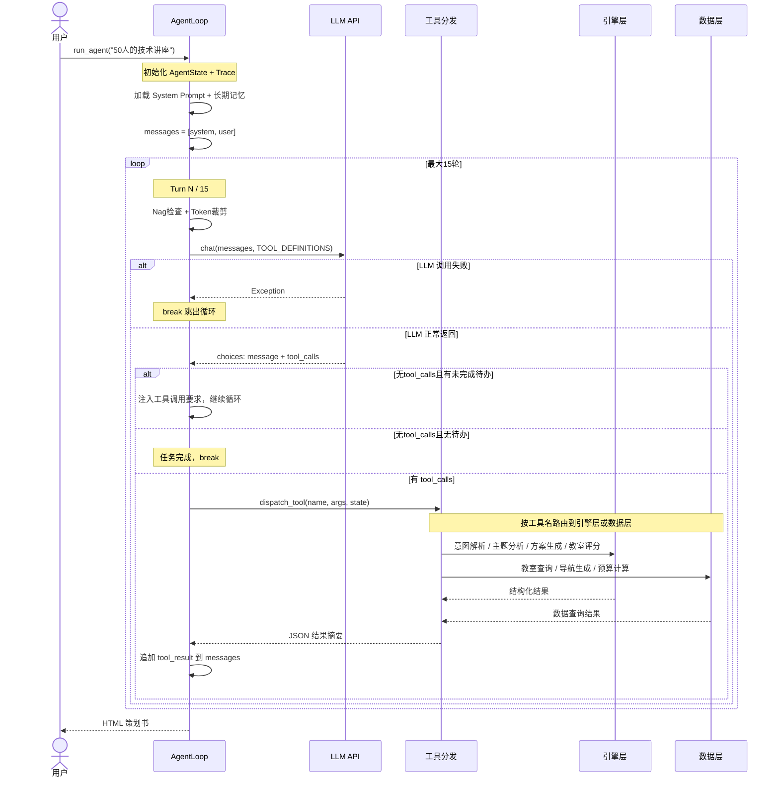

### 14.3 Web 渐进式交互状态机

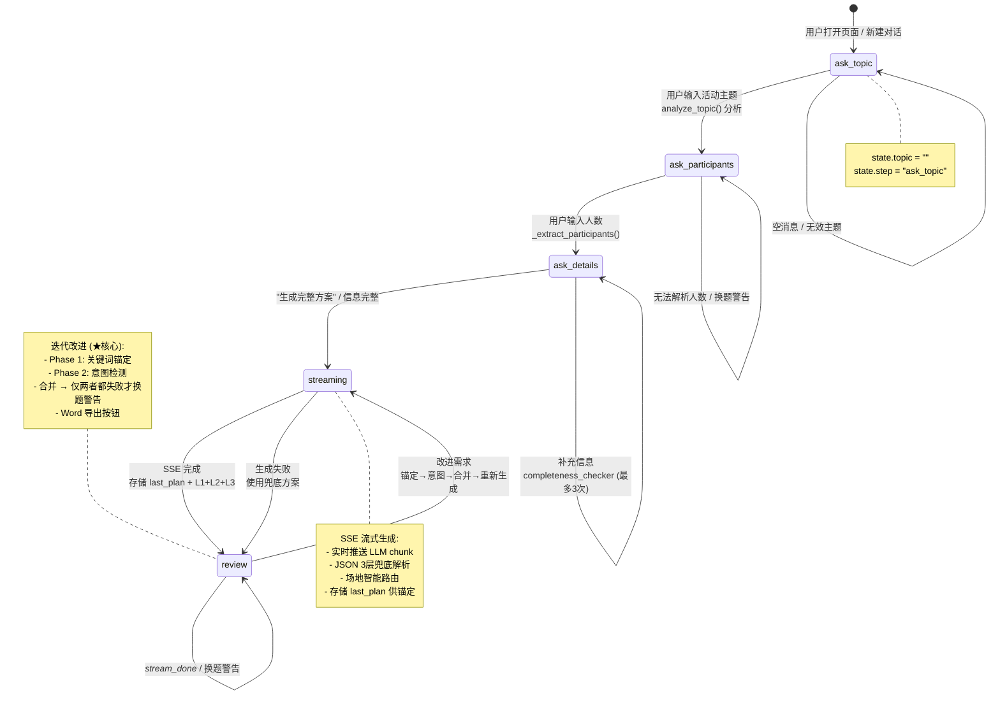

### 14.4 确定性降级流水线（8 步流程图）

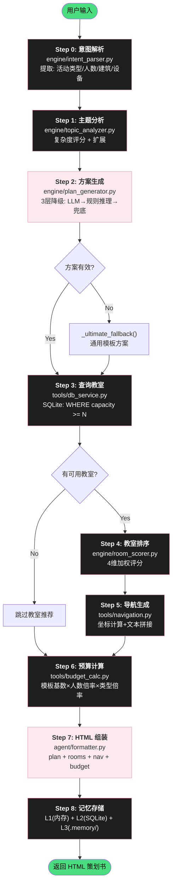

### 14.5 方案生成三层降级策略

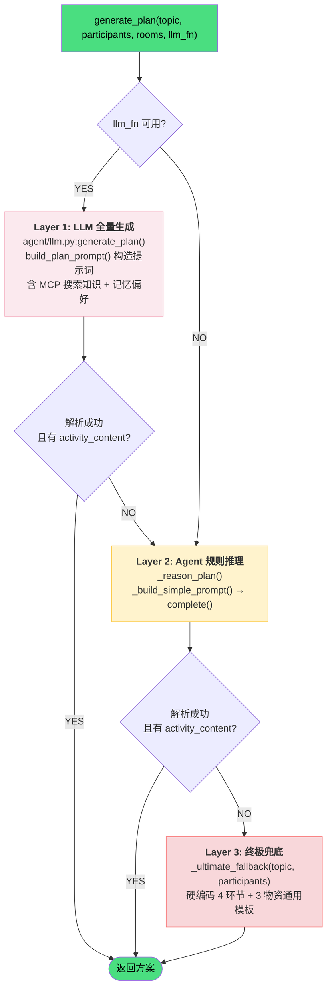

### 14.6 工具调用路由图

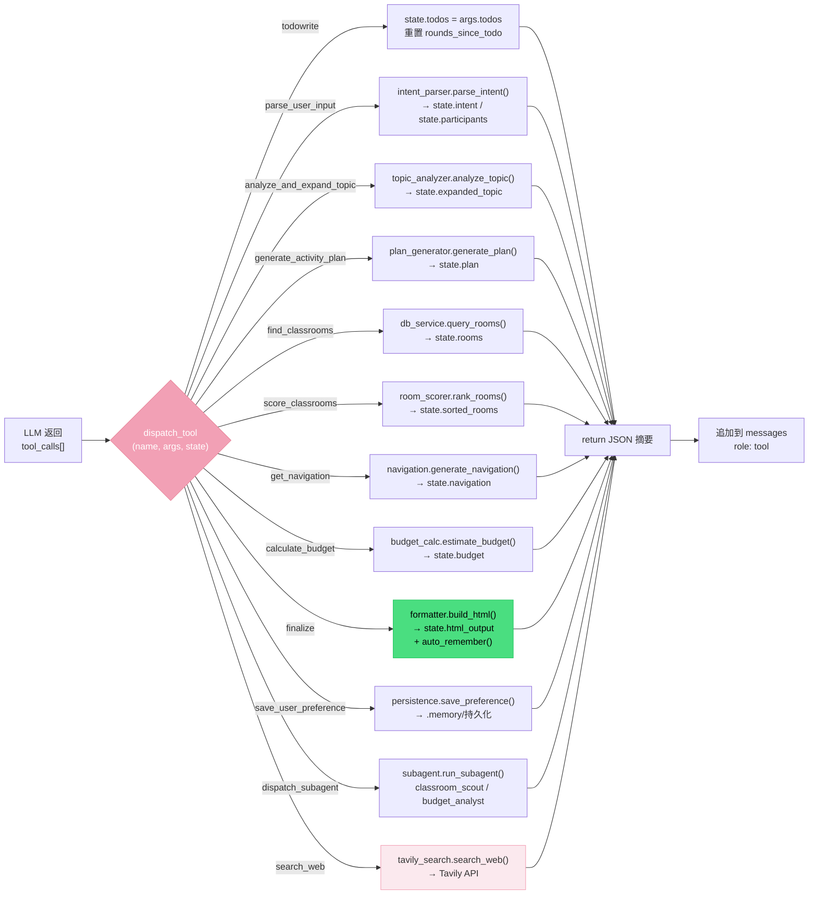

### 14.7 记忆系统三层架构

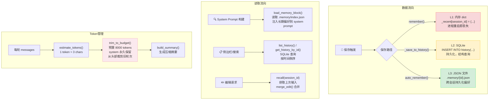

### 14.8 教室多维评分算法图

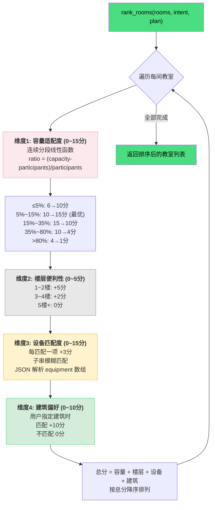

### 14.9 完整端到端时序图（Web 模式）

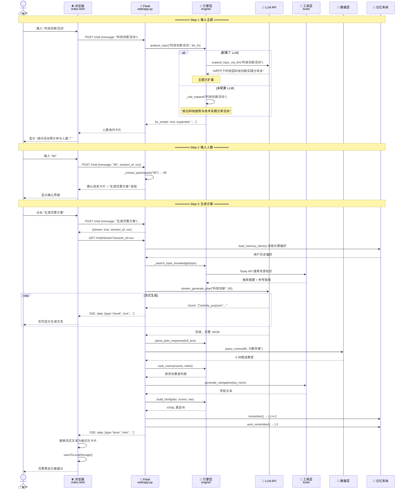

### 14.10 系统启动与初始化流程

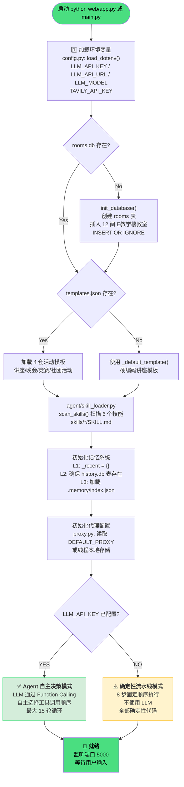

### 14.11 组件依赖关系图

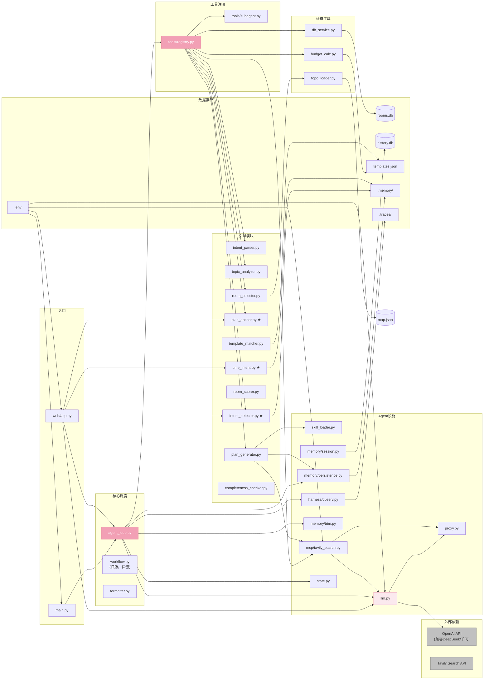

### 14.12 子代理派遣流程

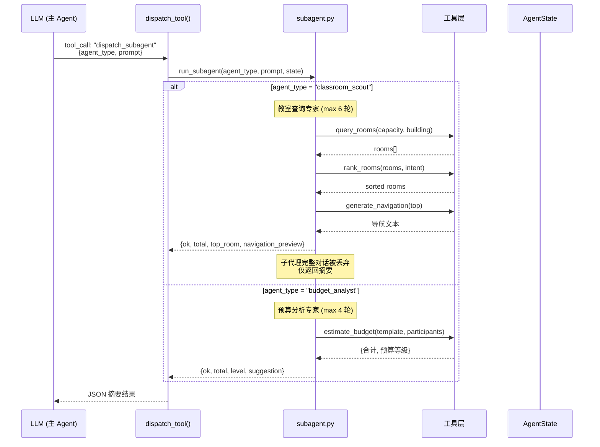

---

### 图表索引

| 编号 | 图表名称 | 类型 | 说明 |
|:---:|---------|------|------|
| 14.1 | 系统分层架构图 | Graph TB | 全部组件的层次关系与数据流向 |
| 14.2 | Agent 主循环时序图 | Sequence | LLM 驱动模式的完整交互时序 |
| 14.3 | Web 交互状态机 | State Diagram | 5 个会话状态的流转规则 |
| 14.4 | 确定性降级流水线 | Flowchart | 8 步固定流程 + 分支处理 |
| 14.5 | 方案生成三层降级 | Flowchart | LLM→规则推理→终极兜底 |
| 14.6 | 工具调用路由图 | Flowchart LR | 12 个工具的 dispatch 路由 |
| 14.7 | 记忆系统三层架构 | Graph TB | L1/L2/L3 的读写与 Token 管理 |
| 14.8 | 教室多维评分算法 | Flowchart | 4 维度评分计算流程 |
| 14.9 | 完整端到端时序图 | Sequence | 从用户输入到 HTML 输出的全路径 |
| 14.10 | 系统启动与初始化 | Flowchart | 启动流程 + 模式选择 |
| 14.11 | 组件依赖关系图 | Graph LR | 全部源文件的 import 依赖关系 |
| 14.12 | 子代理派遣流程 | Sequence | classroom_scout / budget_analyst |
