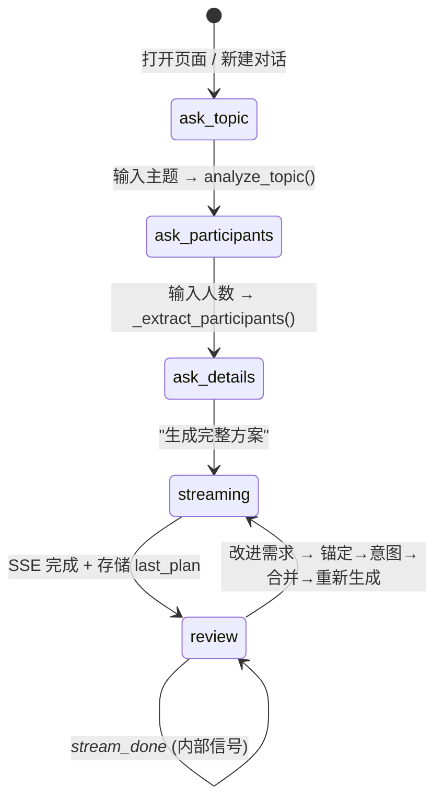
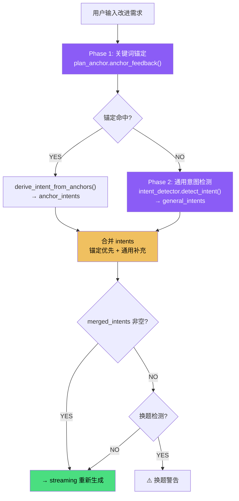
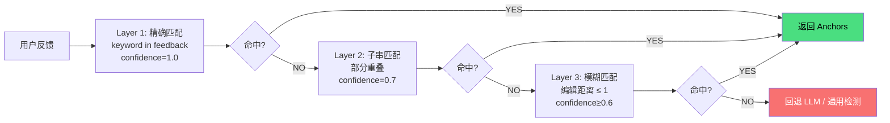

# Campus Compass 完整工作流文档

> 更新日期：2026-06-07 | 基于项目当前代码的完整分析

---

## 一、项目总览

Campus Compass 是一个 **LLM 驱动的校园活动策划 Agent**，采用 **Agent / Skill / Harness 三层架构**，核心设计是 **"Plan-Aware 关键词锚定 + 通用意图检测 + LLM 流式生成"**。

### 1.1 技术栈

| 层级 | 技术 |
|------|------|
| 后端 | Python 3.12 + Flask |
| 前端 | HTML/CSS/JS + TailwindCSS CDN (Star Rail 星穹铁道主题) |
| AI | DeepSeek API (deepseek-chat)，兼容 OpenAI 格式 |
| 数据库 | SQLite (rooms.db 教室 + history.db 历史) |
| 文档导出 | python-docx |
| 记忆 | L1(dict) + L2(SQLite) + L3(JSON) |

### 1.2 项目文件结构

```
campus-compass/
├── agent/                   # Agent 核心层
│   ├── agent_loop.py        #   ReAct 主循环 + Circuit Breaker + Scratch 缓存
│   ├── state.py             #   AgentState 数据类
│   ├── llm.py               #   LLM 流式/非流式调用
│   ├── formatter.py         #   方案 HTML 格式化 (Star Rail 配色)
│   ├── skill_loader.py      #   技能匹配 (88+关键词 + LLM兜底)
│   ├── proxy.py             #   代理管理
│   ├── word_export.py       #   Word 文档导出 (Star Rail 配色)
│   ├── harness/observ.py    #   结构化 Trace
│   ├── mcp/tavily_search.py #   LLM 搜索 (替代 Tavily API)
│   ├── memory/              #   记忆系统 (L1+L2+L3)
│   └── tools/               #   工具白名单 + 子代理
├── engine/                  # 引擎层
│   ├── plan_generator.py    #   方案生成 + JSON 解析 (3层兜底)
│   ├── plan_anchor.py       #   Plan-Aware 关键词锚定 ★NEW
│   ├── intent_detector.py   #   通用修改意图检测 (5类型) ★NEW
│   ├── time_intent.py       #   时间变更检测 (15关键词+9正则) ★NEW
│   ├── intent_parser.py     #   意图解析
│   ├── topic_analyzer.py    #   主题复杂度分析
│   ├── completeness_checker.py  # 信息补全 (最多3次)
│   ├── room_scorer.py       #   教室评分
│   ├── room_selector.py     #   双维度教室选择 (填充率+拓扑距离)
│   └── template_matcher.py  #   模板匹配
├── skills/                  # 技能库 (6种)
├── web/                     # Web 层
│   ├── app.py               #   Flask 应用 (5步交互 + SSE流式 + Word导出)
│   └── templates/index.html #   Star Rail 主题 SPA
├── tools/                   # 工具层
│   ├── db_service.py        #   教室查询
│   ├── budget_calc.py       #   预算计算
│   └── topo_loader.py       #   拓扑距离加载
├── data/                    # 数据层
│   ├── init_db.py           #   数据库 (21教室 + 4场馆)
│   ├── map.json             #   校园拓扑地图
│   └── templates.json       #   活动模板
├── run.py                   # 一键启动 ★NEW
├── requirements.txt         # 依赖清单
└── docs/                    # 文档
```

---

## 二、Web 交互流程 (5 步状态机)

### 状态流转

```
ask_topic → ask_participants → ask_details → streaming → review
    ↑                                                       │
    └───────────────────────────────────────────────────────┘
                     (用户输入改进需求)
```

### Step 1: ask_topic — 输入主题
- 用户输入活动主题
- `analyze_topic()` 评估复杂度，简略主题自动扩展
- `_is_valid_topic()` 校验有效性
- → ask_participants

### Step 2: ask_participants — 确认人数
- `_extract_participants()` 提取人数 (排除日期)
- `_detect_topic_switch()` 换题检测
- → ask_details

### Step 3: ask_details — 补充信息
- `completeness_checker` 评估信息完整度 (最多追问3次)
- 用户可补充时间/物资/人员，或直接点击"生成完整方案"
- → streaming

### Step 4: streaming — SSE 流式生成
- 前端 EventSource → `/chat/stream`
- `stream_generate_plan()` → LLM 流式输出 JSON
- `parse_plan_response()` 解析 (3层兜底)
- 教室查询 + 评分 + HTML 格式化
- `state["last_plan"] = plan` (供后续锚定)
- → review

### Step 5: review — 迭代改进 ★核心
```
用户输入改进需求
  ├─ Phase 1: 关键词锚定 (plan_anchor)
  │   └─ 命中 → 确认是反馈，跳过换题检测
  ├─ Phase 2: 通用意图检测 (intent_detector)
  ├─ 合并意图 → 换题检测 (仅两者都失败时)
  └─ → streaming (重新生成)
```

---

## 三、Plan-Aware 关键词锚定系统 ★

### 3.1 工作流程

```
Plan: {organizer: "计算机学院", activity_content: [{phase: "开幕致辞"}, ...]}
       ↓ build_plan_index()
Index: {
  "计算机学院" → organizer,
  "开幕致辞"   → activity_content[0].phase,
  "主办单位"   → organizer (FIELD_ALIASES 别名),
  "投影仪"     → activity_materials[0].name,
  ...
}
       ↓
User: "把主办单位改成电竞社，投影仪多加2台"
       ↓ anchor_feedback()
Anchors: [
  {keyword: "主办单位", section: "organizer", match_type: "exact", confidence: 1.0},
  {keyword: "投影仪",   section: "activity_materials", index: 0, match_type: "exact"},
]
       ↓ format_anchor_hint()
prompt += """
🎯 已定位到以下要修改的 Plan 元素
📍 organizer「主办单位」(exact 匹配)
📍 activity_materials[0]「投影仪」(exact 匹配)
⚠️ 请只修改锚定的元素，不要改动未锚定的部分
"""
```

### 3.2 三层匹配策略

| 层 | 方式 | 置信度 | 说明 |
|------|------|:--:|------|
| 1 | 精确匹配 | 1.0 | feedback 包含 plan 关键词原文 |
| 2 | 子串匹配 | 0.7 | 部分重叠 (如 "投影" 匹配 "投影仪") |
| 3 | 模糊匹配 | ≥0.6 | 编辑距离 (如 "开场" ≈ "开幕致辞") |

### 3.3 字段别名 (FIELD_ALIASES)

| plan 字段 | 用户常用说法 |
|-----------|------------|
| organizer | 主办单位、主办方、主办 |
| host | 承办单位、承办方、承办 |
| activity_time | 活动时间、时间、日期 |
| activity_purpose | 活动目的、目的、宗旨 |
| activity_content | 活动环节、环节、流程 |
| activity_materials | 物资、材料、设备、道具 |

### 3.4 通用意图检测 (intent_detector)

| 类型 | 触发词示例 | 提取方式 |
|------|-----------|---------|
| time | 活动时间、改成、提前、推迟… | 9 正则 + LLM |
| venue | 换教室、E101、阶梯教室… | 6 正则 + LLM |
| participants | 人数、增加到、减少到… | 3 正则 + LLM |
| content | 增加环节、去掉、互动… | 5 正则 + LLM |
| budget | 预算、控制在、不超过… | 3 正则 + LLM |

硬约束 (必须/改成…) → ⚠️ 必须遵守 | 软偏好 (最好/尽量…) → 💡 尽量满足

---

## 四、方案生成与解析

### 4.1 流式生成

```
stream_generate_plan(topic, participants, active_intents, anchors, last_plan)
  ├─ _search_topic_knowledge() → LLM 搜索背景知识
  ├─ build_plan_prompt() → 构造完整 prompt
  │   ├─ 技能指引 (SKILL.md SOP)
  │   ├─ 长期记忆 (用户偏好)
  │   ├─ 锚定提示 (format_anchor_hint) ★
  │   └─ 意图提示 (apply_intents_to_prompt) ★
  └─ stream_complete() → 逐 chunk 推送
```

### 4.2 JSON 解析 (3层兜底)

```
parse_plan_response(full_text)
  ├─ 清理 markdown 代码块
  ├─ 提取 { } 范围
  ├─ 尝试 1: json.loads() 直接解析
  ├─ 尝试 2: 去尾随逗号后解析 (LLM 常见错误)
  ├─ 尝试 3: 替换弯引号/全角引号后解析
  └─ 失败 → raise ValueError → _ultimate_fallback
```

输出 JSON:
```json
{
  "activity_purpose": "活动目的 (200-300字)",
  "activity_topic": "主题",
  "activity_time": "2026年6月15日14:00-16:00",
  "organizer": "主办单位",
  "host": "承办单位",
  "activity_content": [
    {"phase": "环节名", "duration": "时长", "content": "内容",
     "host_guide": "引导语", "interaction": "互动方式"}
  ],
  "activity_materials": [
    {"name": "物资名", "spec": "规格", "qty": "数量"}
  ]
}
```

---

## 五、教室推荐系统

### 5.1 数据规模

| 建筑 | 教室数 | 容量范围 |
|------|:--:|------|
| E教学楼 (1F) | 21 间 | 42~314 人 |
| 体育区 | 2 个 | 体育馆(300)、田径场(500) |
| 机房区 | 2 个 | E506(100机位)、E507(100机位) |

教室类型: 阶梯教室、普通教室、模拟法庭、阶梯录播教室

### 5.2 场地智能路由

| 活动类型 | 建筑 |
|---------|------|
| 电竞/电子竞技 | 机房区 (E506/E507) |
| 体育/运动 | 体育区 (体育馆/田径场) |
| 讲座/竞赛/演出/展览/实践 | E教学楼 |

### 5.3 双维度评分

**填充率评分 (0~50分)**：最优 70-80% 填充率得满分，过满或过空递减。

**拓扑距离评分 (0~50分)**：基于 `data/map.json` 的 Dijkstra BFS 最短路径，短走廊权重 1、长走廊权重 2。

---

## 六、Agent 工具系统

### 6.1 工具白名单 (12 个)

| 工具 | 功能 | 状态影响 |
|------|------|---------|
| `todowrite` | 编写任务计划 | state.todos |
| `parse_user_input` | 解析用户意图 | state.intent |
| `analyze_and_expand_topic` | 分析扩展主题 | state.expanded_topic |
| `generate_activity_plan` | 生成活动方案 | state.plan |
| `find_classrooms` | 查询教室 (含场地路由) | state.rooms |
| `score_classrooms` | 评分排序教室 | state.sorted_rooms |
| `calculate_budget` | 计算预算 | state.budget |
| `finalize` | 生成 HTML (含前置校验) | state.html_output |
| `save_user_preference` | 保存用户偏好 | .memory/ |
| `dispatch_subagent` | 派遣子代理 | 子代理上下文 |
| `get_current_time` | 获取当前时间 | — |
| `search_web` | LLM 搜索 | — |

### 6.2 安全机制

- **Circuit Breaker**：连续 3 次同一工具+同一参数 → 注入中断警告
- **Finalize 前置校验**：待办未完成 or 活动时间早于当前 → 拒绝 finalize
- **Token 截断**：工具返回结果上限 2000 字符
- **子代理隔离**：独立 messages[] + 工具白名单，无 dispatch_subagent 权限

---

## 七、记忆系统

| 层 | 存储 | 生命周期 | 内容 |
|------|------|------|------|
| L1 | Python dict | 进程存活 | 当前会话状态 |
| L2 | SQLite (history.db) | 持久化 | 历史对话记录 |
| L3 | .memory/ JSON | 永久 | 用户偏好/学习模式/会话 |

**学习机制**：LLM 成功提取时间/意图后，模式自动沉淀到 `.memory/intent_patterns.json`，下次 Token 相似度 ≥0.6 直接复用，无需 LLM 调用。

---

## 八、UI 特性

- **Star Rail 星穹铁道美学**：玻璃拟态、渐变金字、星云紫+琥珀金配色
- **白天/黑夜模式**："曙光"(浅紫暖金) / "星夜"(深空紫)
- **自定义背景图片** (75% 透明度)
- **创意度滑块** (0.3~1.2)
- **聚焦白光环** (focus-within:ring-white/25)
- **Word 一键导出** (.docx, 保持 Star Rail 配色)
- **一键启动** (`python run.py`)

---

## 九、容错与降级

```
Level 0: LLM 流式生成 (最佳)
    ↓ 失败
Level 1: _reason_plan() 规则推理
    ↓ 失败
Level 2: _ultimate_fallback() 通用模板
    ↓ JSON 解析失败
Level 3: 尾随逗号修复 → 弯引号替换 → raise 到上层
```

| 组件 | 失败处理 |
|------|---------|
| LLM API | 网络超时 → 降级流水线 |
| JSON 解析 | 3层修复 → 终极兜底模板 |
| 教室查询 | 无匹配 → 返回空，跳过推荐 |
| python-docx | 未安装 → 自动 pip install |
| 会话 | 进程重启 → .memory/ 恢复 |

---

## 十、可视化工作流

### 10.1 Web 交互状态机



### 10.2 改进反馈处理流程



### 10.3 关键词锚定三层匹配



### 10.4 系统分层架构

```mermaid
graph TB
    subgraph 用户入口
        BROWSER["浏览器 index.html<br/>Star Rail UI"]
        CLI["命令行 main.py"]
    end

    subgraph Web层
        FLASK["Flask app.py<br/>5步状态机 + SSE + Word导出"]
    end

    subgraph Agent核心
        LOOP["Agent Loop<br/>ReAct + Circuit Breaker"]
        LLM["LLM 客户端<br/>DeepSeek API"]
        REGISTRY["工具白名单<br/>12 工具 + 子代理"]
    end

    subgraph 引擎层 (新增)
        ANCHOR["plan_anchor.py ★<br/>关键词锚定"]
        INTENT["intent_detector.py ★<br/>5类型意图检测"]
        TIME_INTENT["time_intent.py ★<br/>时间变更+学习"]
        PLAN["plan_generator.py<br/>3层降级生成"]
        ROOM["room_selector.py<br/>双维度评分"]
    end

    subgraph 数据层
        ROOMS[(rooms.db<br/>21教室+4场馆)]
        HISTORY[(history.db<br/>L2记忆)]
        MEMORY[".memory/<br/>L3+学习模式"]
    end

    BROWSER --> FLASK
    FLASK --> LOOP
    LOOP --> LLM
    LOOP --> REGISTRY
    REGISTRY --> ANCHOR
    REGISTRY --> INTENT
    REGISTRY --> PLAN
    REGISTRY --> ROOM
    ROOM --> ROOMS
    ANCHOR --> MEMORY
    INTENT --> MEMORY

    style ANCHOR fill:#8b5cf6,color:#fff
    style INTENT fill:#8b5cf6,color:#fff
    style TIME_INTENT fill:#8b5cf6,color:#fff
    style LOOP fill:#f0c060,color:#000
```

---

## 十一、Word 导出流程

```
用户点击 "一键导出完整方案"
  ↓
GET /export/word?session_id=xxx
  ↓
读取 state["last_plan"]
  ↓
agent/word_export.py: export_plan_to_docx(plan)
  ├─ python-docx 创建文档
  ├─ Star Rail 配色 (星云紫标题/琥珀金章节/深色表格)
  ├─ 含: 活动目的/基本信息表/活动内容/物资清单/推荐教室
  └─ 返回 .docx 临时文件
  ↓
Flask send_file() → 浏览器下载
```

---

## 十二、配置与启动

### 环境变量 (.env)
```env
LLM_API_KEY=sk-your-deepseek-key-here
LLM_API_URL=https://api.deepseek.com/v1/chat/completions
LLM_MODEL=deepseek-chat
```

### 一键启动
```bash
python run.py
# 自动: 检查依赖 → 安装缺失 → 启动 Flask → 打开浏览器
```

### 手动启动
```bash
pip install -r requirements.txt
python web/app.py
# → http://localhost:5000
```

---

## 十三、架构总结

**核心设计原则**：
1. **Plan-Aware 锚定优先** — 关键词重叠 = 精准定位修改目标，消除 LLM 猜测
2. **缓存优先上下文** — 不可变前缀 + 追加日志，保护 DeepSeek 前缀缓存
3. **多层兜底** — LLM→规则→模板，JSON 解析 3 层修复
4. **学习沉淀** — LLM 成功提取后自动存入可复用模式，避免重复 API 调用
5. **字段别名** — 用户语言 ("主办单位") 自动映射到系统字段 (organizer)

---

**Campus Compass** — 让校园活动策划更简单 ✦
